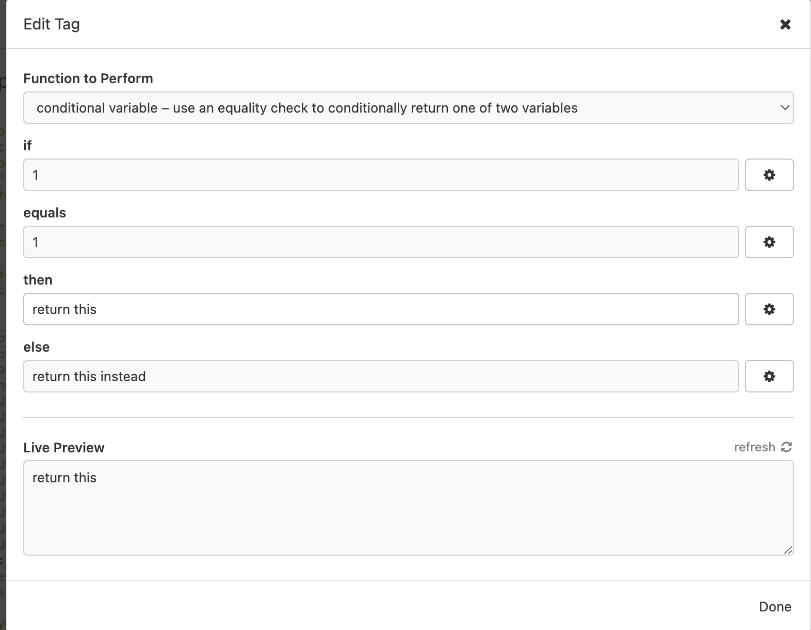
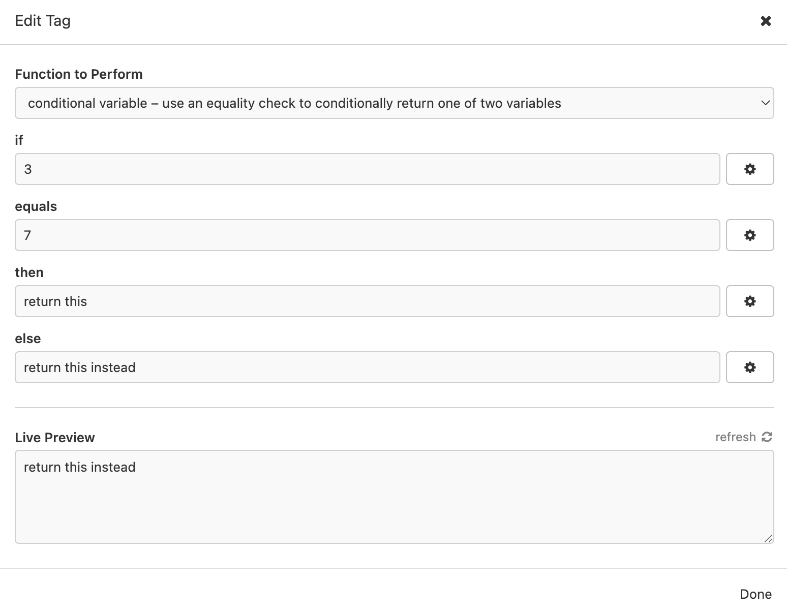

# insomnia-plugin-conditional-selector
simple plugin for insomnia to allow setting environmental variables conditionally.
Can be combined with other environmental variables for added flexibility.

As a simple example with static variables:

if the condition is met:  

or if it is not met:  

